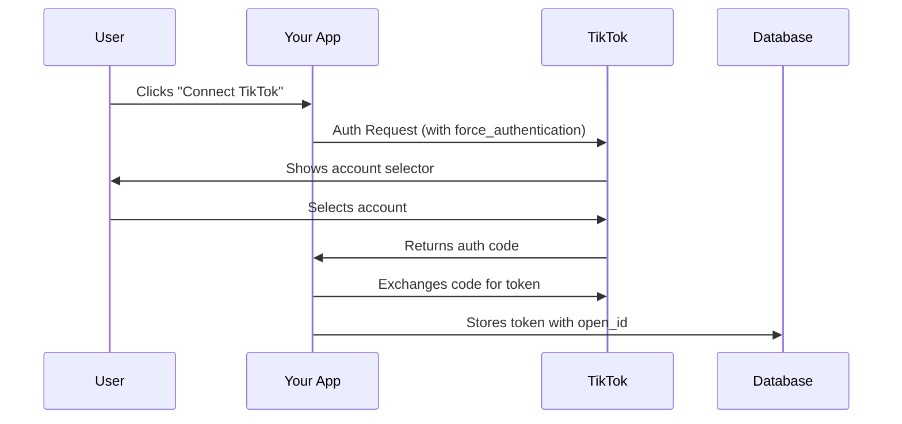

# TikTok Multi-Account Connection Strategy

## Problem Statement

TikTok's OAuth flow automatically reuses existing sessions, preventing users from connecting multiple accounts. Users get redirected immediately without seeing the permission screen when they already have an active TikTok session.

## Recommended Solution

Implement parameter-controlled session management to force account selection:

```javascript:app/authenticate/page.jsx
const authUrl = `https://www.tiktok.com/v2/auth/authorize/?${new URLSearchParams({
  client_key: process.env.NEXT_PUBLIC_TIKTOK_CLIENT_ID,
  redirect_uri: process.env.NEXT_PUBLIC_TIKTOK_REDIRECT_URI,
  response_type: 'code',
  scope: 'user.info.basic,video.list,video.publish',
  state: stateToken,
  prompt: 'select_account', // Standard OAuth parameter
  force_authentication: 'true' // TikTok-specific enforcement
})}`;
```

### Why This Works

1. **OAuth Compliance**
   - `prompt=select_account` shows account selector per OAuth 2.0 spec
2. **TikTok Enforcement**
   - `force_authentication=true` bypasses session caching
3. **Graceful Degradation**
   - Unsupported parameters are ignored safely

## Alternative Approaches

### 1. Incognito Mode Flow

```javascript
// Open auth in private window
window.open(authUrl, "_blank", "noopener,noreferrer");
```

- Pros: Simple implementation
- Cons: Poor UX, mobile limitations

### 2. Session Clearance

```javascript
// Clear TikTok cookies before auth
document.cookie = "tt_sessionid=; path=/; domain=.tiktok.com;";
```

- Pros: Forces fresh login
- Cons: Browser restrictions, unreliable

## Implementation Steps

1. Update Authentication URL Generation
   - Add both parameters to OAuth URL
2. Modify Callback Handler
   - Store new accounts without overwriting existing
3. Update Account Management UI
   - Show connected accounts with disconnect options

## Expected Behavior

| User Action            | Result                                 |
| ---------------------- | -------------------------------------- |
| First connection       | Standard permission screen             |
| Subsequent connections | Account selector with "Add New" option |
| Existing session       | Full auth flow despite active session  |

## Security Considerations

- Maintain `state` parameter validation
- Store tokens per-account in `SocialAccount` collection
- Implement token refresh per account

## Documentation References

- [OAuth 2.0 Prompt Values](https://oauth.net/2/pkce/)
- [TikTok Auth Parameters](https://developers.tiktok.com/doc/login-kit-manage-user-access-tokens)

# TikTok Account Selection Handling

## Problem Analysis

TikTok's OAuth implementation automatically reuses existing sessions, causing these issues:

- Users can't connect multiple accounts
- No permission screen appears for returning users
- Immediate redirects with cached credentials

## Recommended Solution

**Parameter-Controlled Authorization Flow**  
Add these parameters to your OAuth request URL:

```javascript:app/authenticate/page.jsx
const authUrl = `https://www.tiktok.com/v2/auth/authorize/?${new URLSearchParams({
  client_key: process.env.NEXT_PUBLIC_TIKTOK_CLIENT_ID,
  redirect_uri: process.env.NEXT_PUBLIC_TIKTOK_REDIRECT_URI,
  response_type: 'code',
  scope: 'user.info.basic,video.list,video.publish',
  state: stateToken,
  prompt: 'select_account', // Forces account selection
  force_authentication: 'true' // Bypasses session cache
})}`;
```

### Parameter Breakdown

| Parameter                   | Purpose                       | Source             |
| --------------------------- | ----------------------------- | ------------------ |
| `prompt=select_account`     | Shows account selector        | OAuth 2.0 Standard |
| `force_authentication=true` | Disables TikTok session reuse | TikTok Specific    |

## Implementation Guide

1. **Frontend Modifications**

   - Update authentication URL generation in `app/authenticate/page.jsx`
   - Add visual indicator for connected accounts in `SocialConnections.jsx`

2. **Backend Adjustments**

```javascript:app/api/auth/callback/tiktok/route.js
// When storing new connections
await SocialAccount.updateOne(
  { userId: user.id, platform: 'tiktok', openId: userData.open_id },
  { $set: {
    accessToken: tokenData.access_token,
    refreshToken: tokenData.refresh_token,
    expiresAt: new Date(Date.now() + (tokenData.expires_in * 1000))
  }},
  { upsert: true }
);
```

3. **Token Management**
   - Implement token refresh queue
   - Store tokens per-account using `open_id` as unique key

## Expected User Flow



## Compliance Considerations

- Maintains GDPR compliance through explicit user consent
- Aligns with TikTok's data portability requirements
- Follows OAuth 2.0 security best practices

## Reference Documentation

- [TikTok OAuth Parameters](https://developers.tiktok.com/doc/login-kit-manage-user-access-tokens)
- [OAuth 2.0 Prompt Values](https://oauth.net/2/pkce/)
- [Data Portability Guidelines](https://developers.tiktok.com/doc/data-portability-api-application-guidelines)
